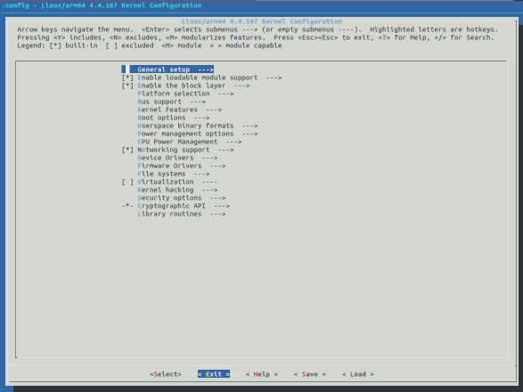
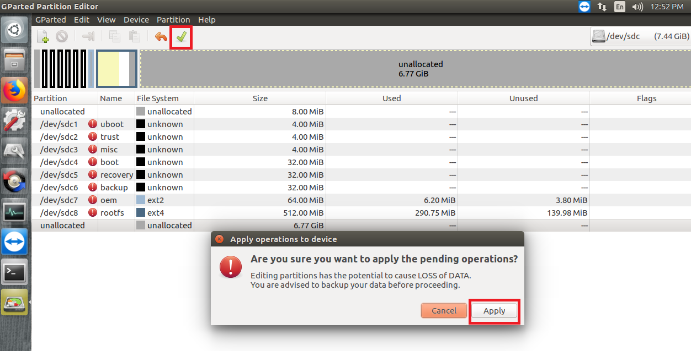

title: How to Build Ubuntu 
---

The procedure to describes how to create Ubuntu image with SD Card on **LEC-PX30 with Industrial Pi-SMARC**. The version of Ubuntu used is 18.04.3 LTS. 

**Note:** PX30 Buildroot only is generated for eMMC booting by default. Therefore, we provide these steps how to generate Ubuntu image for SD caed. 

[Ryan] is it ture??


##   Recommended Hardware

To setup the build environment for Ubuntu image creation, a Linux host with the following configuration is recommended. A host machine with adequate processing power and disk space is ideal as the packages can run several GBs in size and the build can take a lot of time.

- Intel Core-i7 processor (>= 4 cores)
- 8 GB RAM
- 1 TB disk space
- High speed network connectivity
- OS: Ubuntu 16.04 LTS/Ubuntu 18.04 LTS

Update apt repositories list on your host machine.

```shell
$ sudo apt update
```

Install kernel and u-boot dependencies.

```shell
$ sudo apt-get install git-core gnupg flex bison gperf build-essential zip curl
zlib1g-dev gcc-multilib g++-multilib libc6-dev-i386 lib32ncurses5-dev
x11proto-core-dev libx11-dev lib32z1-dev ccache libgl1-mesa-dev libxml2-utils
xsltproc unzip device-tree-compiler liblz4-tool
```

Install buildroot dependencies.

```
$ sudo apt-get install libfile-which-perl sed make binutils gcc g++ bash patch gzip
bzip2 perl tar cpio python unzip rsync file bc libmpc3 git repo texinfo pkg-config cmake
tree texinfo
```


## Here is the step:

**Step 1**: Prepare Ubuntu root file systme Image, as mentioned in "**Preparing Ubuntu Root File System**" section.

**Step 2**: Generate Buildroot SD Card Image, as mentioned in "**Generating Buildroot Image**" section.

**Step3**: Flash image (generated in Step2) to the prepared SD card by using **SD Firmware Tool**, as mentioned in "**Flashing buildroot image to SD Card**" section

**Step4**: Replace the orginal rootfs image with Ubuntu one, as mentioned in "**Replcing Rootfs image with Ubuntu one**"


## Step1: Preparing Ubuntu Root File System

1. Install QEMU on the development host PC with Ubuntu OS

   ```
   $ sudo apt-get install qemu-user-static
   ```

2. Download Ubuntu 18.04 base from http://cdimage.ubuntu.com/ubuntu-base/releases/18.04/release/   and choose this one: `ubuntu-base-18.04.1-base-arm64.tar.gz`

3. Create a temporary folder and extract downloaded tarball into the folder.

   ```
   $ mkdir $HOME/temp
   ```

4. Extract the file to temp folder

   ```
   $ sudo tar -xpf ubuntu-base-18.04.2-base-arm64.tar.gz -C $HOME/temp
   ```

   

### Configure the rootfs

1. Get your network ready:

   ```
   $ sudo cp -b /etc/resolv.conf $HOME/temp/etc/resolv.conf
   ```

2. Prepare QEMU:

   ```
   $ sudo cp /usr/bin/qemu-aarch64-static $HOME/temp/usr/bin/
   ```

3. Change root:

   ```
   $ sudo chroot $HOME/temp
   ```

4. Update and upgrade:

   ```
   $ apt update
   $ apt upgrade
   ```

5. Install the required tools or utilities.  While installing the tools/utilities, you will be prompted through GUI menu to make certain selections such as those for date/time/region. Please make the appropriate selections and proceed.

   ```
   $ apt install vim git sudo net-tools ifupdown kmod iputils-ping man wget bash-completion alsa-utils apt-utils usbutils locales i2c-tools netplan.io vnc4server lm-sensors usbmount gcc g++ cmake  can-utils sox v4l-utils glmark2 xubuntu-desktop 
   ```

6. Add user name (here is the example how to add it. You can enter what you want)

   ```
   $ useradd -s '/bin/bash' -m -G adm,sudo adlink
   ```

8. Set user’s password (here is the example how to add it. You can enter what you want)

   ```
   $ passwd adlink123
   ```

9. Set the root user’s password (here is the example how to add it. You can enter what you want)

   ```
   $ passwd root
   ```

10. Add host name to `/etc/hostname`(here is the example how to add it. You can enter what you want)

       ```
    $ echo ‘adlink’ > /etc/hostname
       ```
    
10. Add host entry in `/etc/hosts`

    ```
    $ sudo vim /etc/hosts
    ```

    Add the following configuration:

    ```
    127.0.0.1 localhost
    127.0.0.1 adlink
    ```

11. After all the work is done, exit the chroot environment.

    ```
    $ exit
    ```


### Add I/O Drivers to Rootfs 

####     - Ethernet & CAN Bus

1. Create a directory to copy the Ethernet and CAN kernel modules

    ```
    $ sudo mkdir $HOME/temp/home/adlink/rockchip_test
    ```
    
2. Please click [here](https://hq0epm0west0us0storage.blob.core.windows.net/development/LEC-PX30/Images/Ubuntu/UbuntuNecessaryFiles/Ubuntu-kernel-module_2020-02-24.zip) to download and copy  **smsc9500.ko,  smscusbnet.ko and mcp25xxfd.ko kernel modules** into rockchip_test folder from host PC. 

    ```
    $ sudo cp <your_path>/*.ko $HOME/temp/home/adlink/rockchip_test/
    ```

3. Use Netplan to enables easily configuring networking on system. Please create a `01-network-manager-all.yaml` file under /etc/netplan

    ```
    $ sudo vim $HOME/temp/etc/netplan/01-network-manager-all.yaml
    ```

    Add the following content, then save it.
    
    ```
    # Let NetworkManager manage all devices on this system 
    network:
      version: 2
      renderer: NetworkManager
    ```
    
    **Note:** [Netplan](https://wiki.ubuntu.com/Netplan) enables easily configuring networking on a system via YAML files. Netplan processes the YAML and generates the required configurations for either NetworkManager or systemd-network the system’s renderer. Netplan [replaced ifupdown](http://blog.cyphermox.net/2017/06/netplan-by-default-in-1710.html) as the default configuration utility starting with Ubuntu 17.10 Artful. 

####    - Audio

1. Please click [here](https://hq0epm0west0us0storage.blob.core.windows.net/development/LEC-PX30/Images/Ubuntu/UbuntuNecessaryFiles/asound.state) to download **asound.state** file and copy to `/var/lib/alsa/`

   ```
   $ sudo cp asound.state $HOME/temp/var/lib/alsa/
   ```

####    - Enable I/O Interfaces 

1. Please click [here](https://hq0epm0west0us0storage.blob.core.windows.net/development/LEC-PX30/Images/Ubuntu/UbuntuNecessaryFiles/Load.sh) to download and copy **Load.sh** file to the `rockchip_test`folder. 

   **Note**: it is shell script to insert modules on every reboot 

   ```
   $ sudo cp Load.sh $HOME/temp/home/adlink/rockchip_test/Load.sh
   ```

2. Give execute permissions to script
   ```
   $ sudo chmod +x $HOME/temp/home/adlink/rockchip_test/Load.sh
   ```

3. Please click [here](https://hq0epm0west0us0storage.blob.core.windows.net/development/LEC-PX30/Images/Ubuntu/UbuntuNecessaryFiles/rc.local) to download and copy **rc.local** to `temp/etc/` 

   ```
   $ sudo cp rc.local $HOME/temp/etc/
   ```

4. Give executable permissions.
   ```
   $ sudo chmod +x $HOME/temp/etc/rc.local
   ```

#### - Adding MRAA 

1. Download the `adlink-mraa-master.tar` file from [here](https://hq0epm0west0us0storage.blob.core.windows.net/development/LEC-PX30/Images/Ubuntu/UbuntuNecessaryFiles/adlink-mraa-master.tar) and extract and copy the binaries, applications and libraries to respective folders:

   ```
   $ mkdir $HOME/mraa
   $ tar -xvf adlink-mraa-master.tar -C $HOME/mraa/
   $ sudo cp -r $HOME/mraa/usr/bin/* $HOME/temp/usr/bin/
   $ sudo cp -r $HOME/mraa/usr/include/* $HOME/temp/usr/include/
   $ sudo cp -r $HOME/mraa/usr/lib/libmraa.so* $HOME/temp/usr/lib/
   $ sudo cp -r $HOME/mraa/usr/lib/pkgconfig/mraa.pc $HOME/temp/usr/lib/pkgconfig/
   $ sudo cp -r $HOME/mraa/usr/share/* $HOME/temp/usr/share/
   ```


### Make the Root File System

Execute the commands below to make the rootfs.img. Notice that you need change the “count” value according to the size of the “temp” folder.

Below command will create new rootfs.img file of size 7.4 GB (6.9 GB)

    $ dd if=/dev/zero of=rootfs.img bs=1M count=7065 status=progress && sync
    $ sudo mkfs.ext4 rootfs.img
    $ mkdir rootfs
    $ sudo mount rootfs.img rootfs/
    $ sudo cp -rfp $HOME/temp/*  rootfs/
    $ sudo umount rootfs/
    $ e2fsck -p -f rootfs.img

 The final root files system rootfs.img is ready.


### Adding RFS Image to Buildroot 

To add the created root file system image to LEC-PX30 Buildroot Linux, follow the procedure below:

Before start to compile Buildroot, please Install the required packages on the development host PC.

```
$ sudo apt-get install repo git-core gitk git-gui gcc-arm-linux-gnueabihf u-boot-tools device-tree-compiler gcc-aarch64-linux-gnu mtools parted libudev-dev libusb-1.0-0-dev python-linaro-image-tools linaro-image-tools autoconf autotools-dev libsigsegv2 m4 intltool libdrm-dev curl sed make binutils build-essential gcc g++ bash patch gzip bzip2 perl tar cpio python unzip rsync file bc wget libncurses5 libqt4-dev libglib2.0-dev libgtk2.0-dev libglade2-dev cvs git mercurial rsync openssh-client subversion asciidoc w3m dblatex graphviz python-matplotlib libc6:i386 libssl-dev texinfo liblz4-tool genext2fs lib32stdc++6
```

1. Download [LEC-PX30 Buildroot SDK](https://hq0epm0west0us0storage.blob.core.windows.net/development/LEC-PX30/SDK/v1.0.8-20200125/px30_buildroot_es2_sdk_20200125.tar.gz) and extract it.

   **Note**: use `iPIsmarc-es2` branch and root for the building. use`git branch` command under **px30_buildroot/kernel** to check the branch version.

2. Change directory to px30_buildroot.

   ```
   $ cd px30_buildroot
   ```

3. Create a temporary directory.

   ```
   $ mkdir ubunturootfs
   ```

4. Copy the created rootfs.img to ubunturootfs.

   ```
   $ cp <path_to_ubuntu_rootfs>/rootfs.img ubunturootfs
   ```

5. Create a **parameter-ubuntu.txt** file under device/rockchip/px30 folder.

   ```
   $ cp device/rockchip/px30/parameter-buildroot.txt device/rockchip/px30/parameter-ubuntu.txt
   ```

6. Change directory to ubunturootfs folder and to check UUID of rootfs image, run the command below.

   ```
   $ file ubunturootfs/rootfs.img
   ```
   
   

7. Modify UUID you have in`parameter-ubuntu.txt` file

   ```
   $ vi device/rockchip/px30/parameter-ubuntu.txt
   ```

    
   
   Now, modify the rootfs size and alter the user data starting address as per requirement. In the screenshot below, we are changing rootfs size to 7GB.
   
8. Open `BoardConfig_open.mk` file and change the path for `parameter-ubuntu.txt` and `rootfs.img` files.

   ```
   $ sudo vi device/rockchip/px30/BoardConfig_open.mk
   ```
   
    

9. Open `rk3326.dtsi` file and add new part UUID or device partition. In the screenshot below, we have added `/dev/mmcblk1p8 partition`.

   ```
   $ sudo vi kernel/arch/arm64/boot/dts/rockchip/rk3326-linux.dtsi
   ```
   
   

10. Change directory to `px30_buildroot`

       ```
      $ cd px30_buildroot
       ```


11. Run build.sh

       ```
      $ ./build.sh
       ```

12. After you run "./build.sh", a menuconfig screen will appear as shown below. Select **"Exit"** as shown below.

    

    **Note:** The image will be generated as **"update.img"** under rockdev folder.

[Ryan]

  Do we need to create update,.img? because pure buildroot image we also generate? 


## Step 2: **Generating Buildroot Image**

Download [LEC-PX30 Buildroot SDK](https://hq0epm0west0us0storage.blob.core.windows.net/development/LEC-PX30/SDK/v1.0.8-20200309/px30_buildroot_es2_sdk_20200309.tar.gz) and extract it. ( the same source as Step1)

[Ryan] do we need to download again? or use the same source ( step 1) is ok? 


**Note**: Use `iPIsmarc-es2` branch and root for building. Use `git branch` command under **px30_buildroot/kernel** to check the branch version.

Change directory to px30_buildroot.

```shell
$ cd px30_buildroot
```

Run build script.

```shell
$ ./build.sh
```

After you run "./build.sh", a menuconfig screen will appear as shown below. Select **"Exit"** as shown below.


The image will be generated as **"update.img"** under rockdev folder.


## Step 3: Flashing buildroot image to SD Card

Flash image (generated in Step2) to the prepared SD card by using **SD Firmware Tool**

**Note:** Before going to flash image to SD card, format it. The size should be at least 8 Gb.

- Download the SD Firmware Tool from [SD Firmware Tool Download Link](https://hq0epm0west0us0storage.blob.core.windows.net/development/LEC-PX30/Tools/SDDiskTool_v1.6.rar)
- Use **SD Firmware Tool** to prepare a bootable SD card. 
- Run **SD Firmware Tool**  as a administrator.
- Select "Removable Disk" as SD card.  Choose "Function Mode" as SD boot. Load the SD card image as "Firmware" as shown below.


- Select "Create" to prepare SD card.
- It will prompt user that data will be lost. Select "Yes" to continue.


## Step4: Replcing Rootfs image with Ubuntu one

After finish stpe 3, please make sure your SD card is connected to the development Host PC.

1. unmount the mounted partitions

   ```
   $ sudo umount /dev/sdc*
   ```

   **Note:** In our case, `/dev/sdc is SD card device name

2. Run **GParted** by using command line

   ```
   $ sudo gparted
   ```

   **Note**: GParted is a free partition editor for graphically managing your disk partitions. Please check [this link](https://gparted.org/index.php).  

3. Select SD card as highlighted in above corner in below picture


4. Select partition 9 and give right click, then select delete


5. Save the changes and select apply

   


6. After changes are applied, select close.

   


7. Select the root fs partition and select resize option above. Partition 8 (/dev/sdc8) is the rootfs partition in below picture.

   


8. Increase the size and select Resize/Move option

   

9. Save the changes and select apply

   


10. Close the GParted application and eject SD card and connect SD Card to the development Host PC.

11. Run **lsblk** command to get the path for mounted rootfs partition

    


12. Remove the existing contents as this file system is the default build root file system.

    ```
    $ sudo rm -rf <mount_path>/*
    $ sync
    ```

    For example, the required partition is **sdc8** here with path **/media/nhcpc20011/ac09cb0f-0d9b-4441-902c-bf48b1f10127/**

    

13. Create a temporary directory and mount the **rootfs.img**, which is prepared at step1

    ```
    $ mkdir $HOME/sd_temp
    $ sudo mount rootfs.img $HOME/sd_temp
    ```

    

14. Run the following commands to copy the contents of the ubuntu rootfs.img to the SD card.

    ```
    $ sudo cp -rfp $HOME/sd_temp/* <mount_path>/
    $ sync
    $ sudo umount $HOME/sd_temp
    ```

    Eject the SD card. You can directly insert SD card and power on the system to boot using the SD card.

    **Note:** The first boot may take over 5 minutes for the desktop screen to appear.

